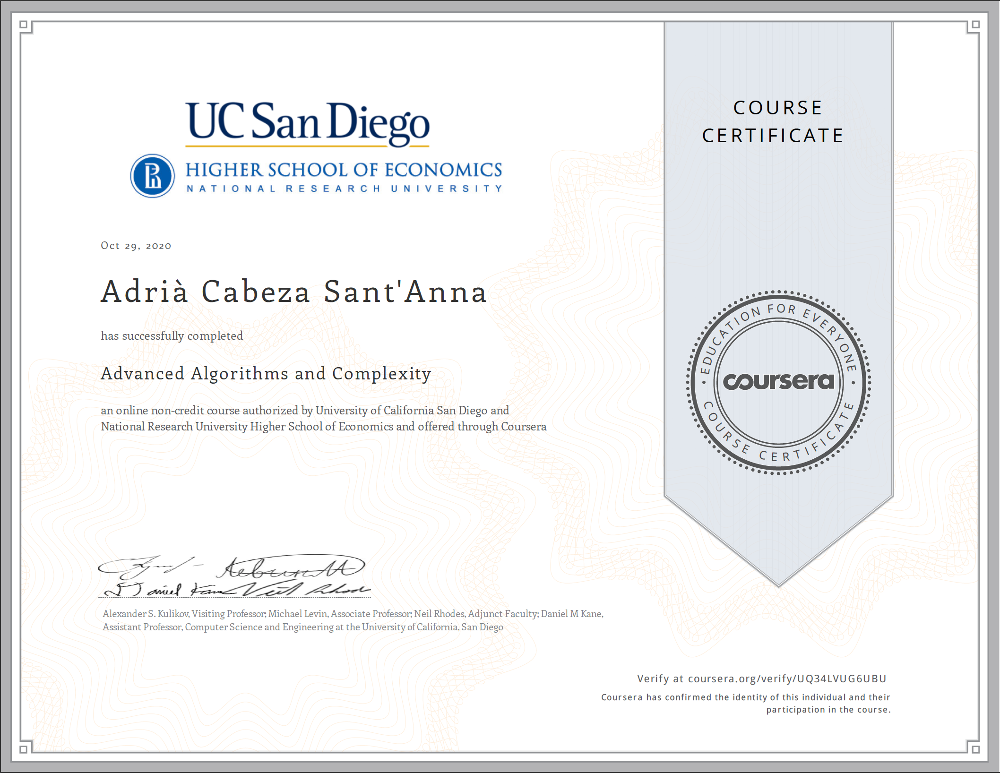

# Advanced Algorithms and Complexity Course
This repository contains some of the problem assignments from the Advanced Algorithms and Complexity Course from the University of San Diego.

- [Flows in Networks](./1-Flows-In-Network): 
    - **Evacuation**: Applying an algorithm for finding maximum flow in a network to determine how fast people can be evacuated from the given city.
    - **Airline Crew**: Applying an algorithm for finding maximum matching in a bipartite graph to assign airline crews to flights in the most efficient way.
    - **Stock Charts**: Applying a flow algorithm approach to find the minimum Path Cover in a DAG to compute the maximum number of stock charts that do not intersect.
- [Linear Programming](./2-Linear-Programming):
    - **Energy values**: Applying Gaussian elimination to solve a problem where we have to tell the amount of nutrients that each ingredient has.
    - **Diet**: Applying Gaussian elimination to perform a brute force linear programming approach
- [NP-Completeness](./3-NP-Completeness):
    - **GSM Network**: encoding to SAT the 3-coloring problem to determine if we can make a GSM network work
    - **Cleaning the apartment**: encoding to SAT the Hamiltonian Path problem to find a a clever way to clean your apartment
- [Coping with NP-completeness](./4-Coping-with-NP-completeness):
    - **Integrated Circuit Design**: solving 2-SAT by constructing a directed implications graph and looking for different strongly connected components to design part of an integrated circuit
    - **Plan a Fun Party**: computing maximum independent set of a tree to plan a fun party
    - **School Bus**:

Certificate:

